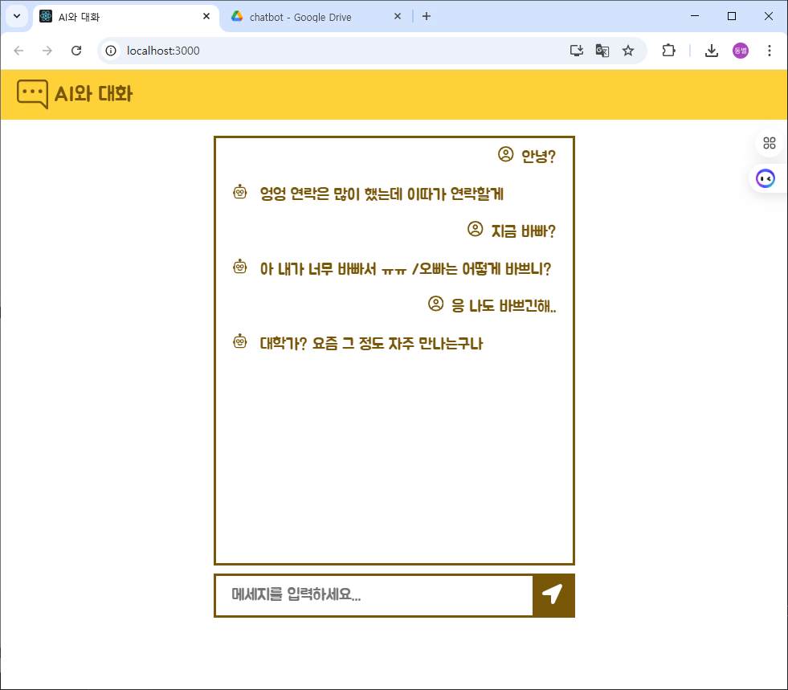
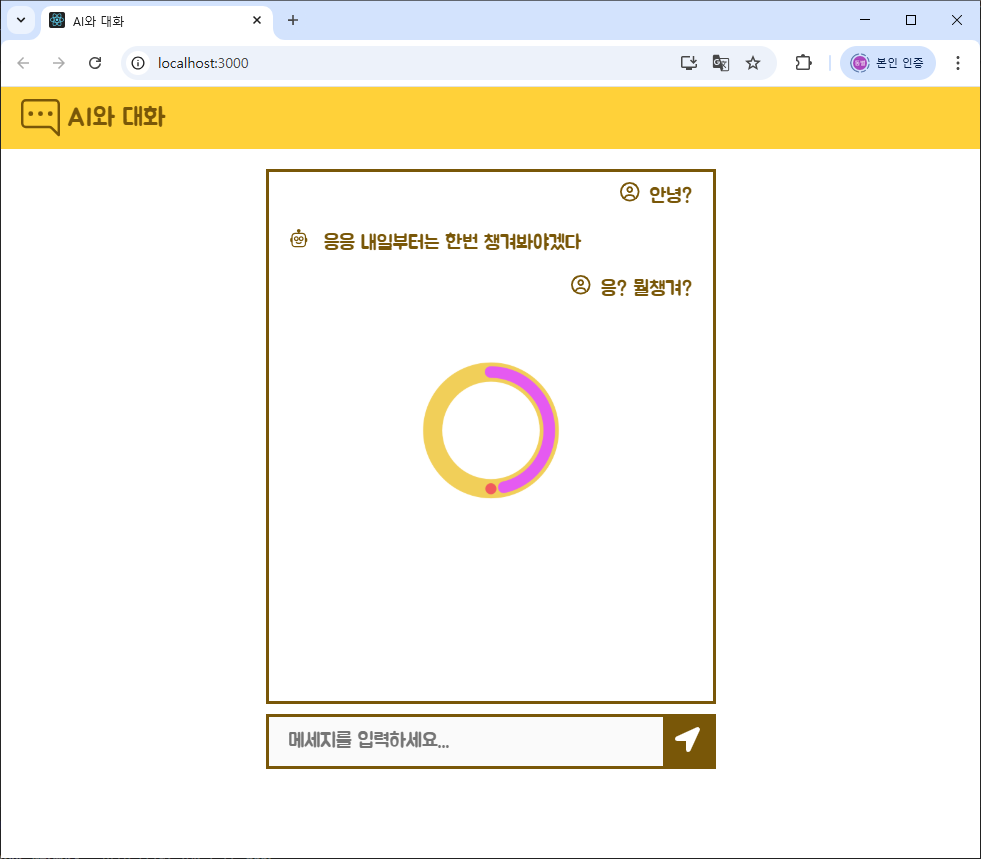

# 챗봇 프론트앤드
## 개요
React를 기반으로 한 챗봇 웹 클라이언트입니다.  
사용자는 이 UI를 통해 채팅 메시지를 주고받고, 봇의 응답을 실시간으로 확인할 수 있습니다.

## 주요 기능
- React 라우팅 (`react-router-dom`)을 활용한 페이지 전환  
- 코드 스플리팅 및 동적 로딩 (`@loadable/component`)  
- 스타일링: Sass(`sass`) 및 CSS-in-JS(`styled-components`)  
- 상태 불변성 관리를 돕는 `immer`  
- 아이콘: `react-icons`  
- SEO 지원을 위한 `react-helmet-async`  
- 웹 성능 측정: `web-vitals`  
- 테스트: `@testing-library/react` 계열  
- 프로덕션 빌드 후 정적 파일 제공용 `serve`

## 기술 스택
- **React** `^19.1.0`  
- **React Router** (`react-router-dom` `^7.6.3`)  
- **Styled Components** `^6.1.19`  
- **Sass** `^1.89.2`  
- **Loadable Components** `^5.16.7`  
- **Immer** `^10.1.1`  
- **React Helmet Async** `^2.0.5`  
- **React Icons** `^5.5.0`  
- **Web Vitals** `^2.1.0`  
- **Testing Library** (`@testing-library/react` 등)  
- **Serve** `^14.2.4`

## 설치 및 실행

```bash
```bash
# 클론 및 이동
git clone <repository-url> quick_draw_fe
cd quick_draw_fe

# 의존성 설치
yarn install

# 개발 서버
yarn start

# 프로덕션 빌드
npm run build

# 정적 파일 제공
npx serve -s build
```

## 디렉터리 구조
```
chatbot_fe/
├── public/                # 정적 파일 (index.html 등)
├── src/
│   ├── assets/            # 이미지, 폰트 등
│   ├── components/        # 재사용 가능한 컴포넌트
│   ├── hooks/             # 커스텀 훅
│   ├── pages/             # 라우트별 페이지 컴포넌트
│   ├── services/          # API 호출 모듈 (Axios 설정)
│   ├── styles/            # 전역 스타일
│   ├── App.jsx
│   └── index.jsx
├── package.json
└── README.md

```

## 환경 변수
- 프로젝트 루트에 .env 파일을 생성하고 다음을 설정합니다:

```env
REACT_APP_API_BASE_URL=http://localhost:3000
```

## 배포
```
yarn add serve
yarn build
npx serve -s build -l 3000
```
## 구현 화면
### 메인 화면



